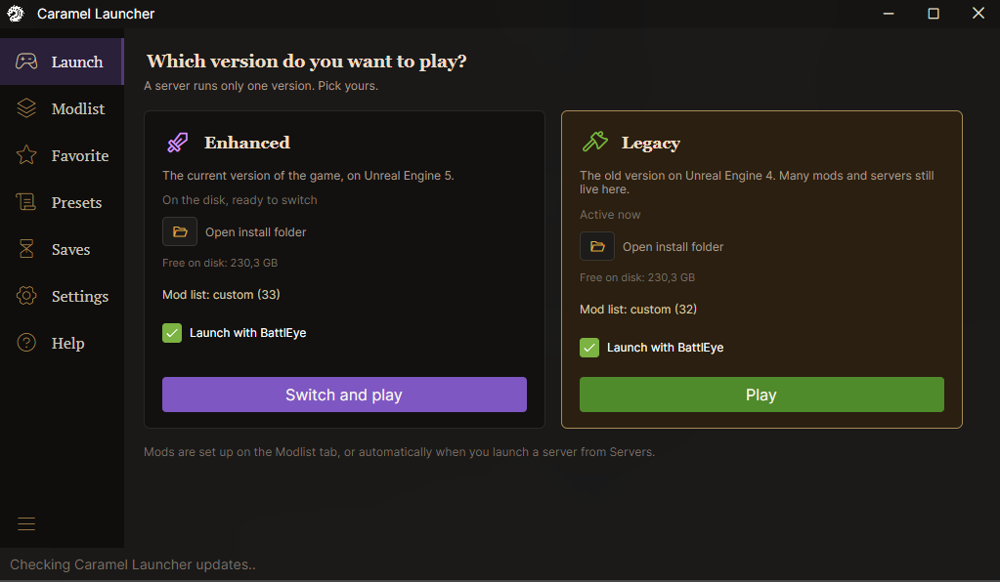
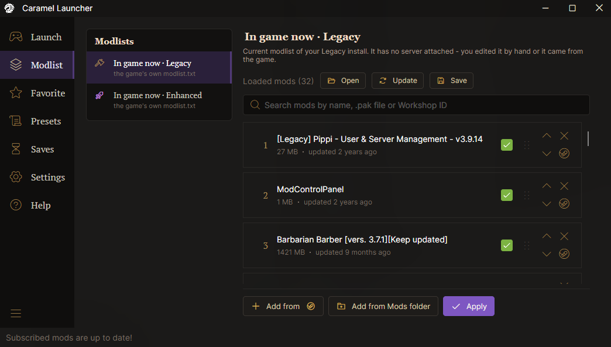
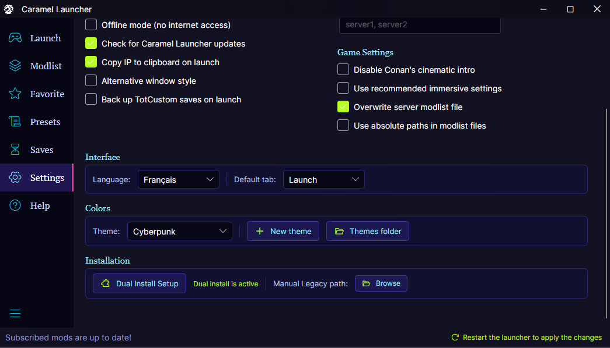
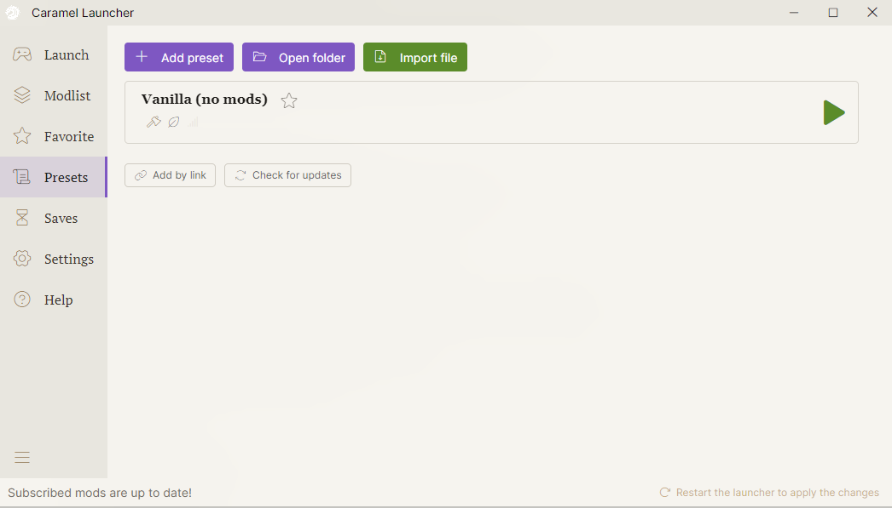

# Caramel Launcher

[](LICENSE)
[](https://discord.gg/ckvWJ3Q2du)


<a href="https://github.com/Ewallee/caramel-launcher/raw/main/CaramelLauncher.zip"></a>

A launcher and mod manager for Conan Exiles.

A modded server needs the right game version, the right mods and the right mod order.
The admin puts all of that into one config file. Players add it to Caramel Launcher
and press Play: the launcher prepares the game version, downloads the mods, writes
the mod list and joins the server.



## What it does

- **6 languages.** English, Русский, Français, Deutsch, Español, 中文.
- **Themes.** Thirteen dark and light themes out of the box, or make your own: the launcher repaints as soon as you save.
- **Legacy and Enhanced on one PC.** Switches between the two game versions in one click.
- **Mods through Steam.** Downloads and updates Workshop mods, no SteamCMD or login.
- **Mod manager.** Add mods from the Workshop or the Mods folder; update, unsubscribe or delete them in one window.
- **Correct mod order.** No more mod mismatch on join.
- **One config per server.** Added once by link or file, updates itself.
- **Updates itself.** New versions install on launch.



## Install

1. Download [CaramelLauncher.zip](https://github.com/Ewallee/caramel-launcher/raw/main/CaramelLauncher.zip) - the button above.
2. Unpack it anywhere except `Program Files`.
3. Run `CaramelLauncher.exe`. Steam must be running.

The app is not code-signed, so Windows SmartScreen warns on first run: **More info → Run anyway**.

## Themes

| Theme | |
|---|---|
| [Caramel](themes/caramel.json) | dark, built in |
| [Autumn](themes/autumn.json) | dark, warm charcoal, amber and burnt orange |
| [Cimmeria](themes/cimmeria.json) | dark, cold steel blue |
| [Cyberpunk](themes/cyberpunk.json) | dark, neon cyan, magenta and acid lime |
| [DeepSeek](themes/deepseek.json) | dark, deep sea blue, gold and turquoise |
| [Jungle](themes/jungle.json) | dark, deep green, brass and copper |
| [Night Wolf](themes/night-wolf.json) | dark, moonlit night, silver and violet |
| [Red Rift](themes/red-rift.json) | dark, black and steel, active in blood red |
| [Stygia](themes/stygia.json) | dark, obsidian, gold, turquoise and green cat eyes |
| [Frost](themes/frost.json) | light, ice blue and deep blue |
| [Light](themes/light.json) | light, parchment and lavender |
| [Red Rift Light](themes/red-rift-light.json) | light, marble, bronze and blood red |
| [Sakura](themes/sakura.json) | light, pink and orchid |

Pick a theme in **Settings → Colors**. To make your own, press **New theme** there: it copies the
current colors into a file with a caption on every line. Edit and save - the launcher repaints at once.

To add someone else's theme, put the `.json` file into the `themes` folder next to `CaramelLauncher.exe`.

 

## For server admins

A server config is one JSON file:

```json
{
  "name": "My Server [PVE]",
  "ip": "203.0.113.10:7777",
  "query": 27015,
  "version": "legacy",
  "battleye": false,
  "mods": [
    "880454836/Pippi.pak",
    "1823412793/ModControlPanel.pak"
  ]
}
```

- `ip` - address with the game port
- `query` - Steam query port, for the player count
- `version` - `legacy` or `enhanced`
- `mods` - in load order, `<WorkshopID>/<Mod>.pak`

Share the file or a link to it.

## Credits

Based on [Conay](https://github.com/RatajVaver/conay) by RatajVaver, MIT licensed - see [LICENSE](LICENSE).
All credit for the original work goes to him.

Caramel Launcher is an independent community project, not affiliated with or endorsed
by Funcom or Conan Properties International.
